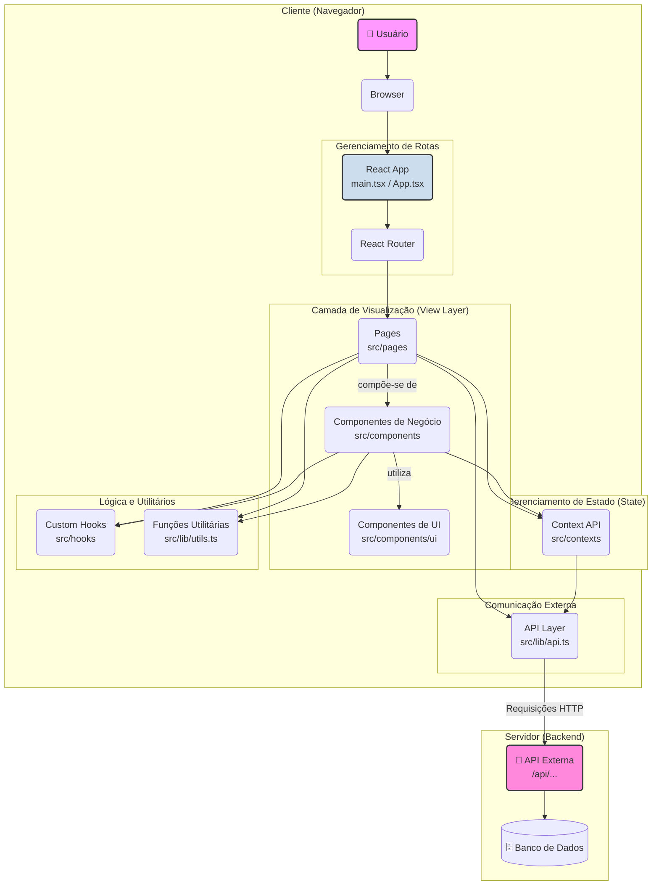

# Arquitetura do Projeto FeedTrack

Este documento descreve a arquitetura do frontend da aplicação FeedTrack, construída com React e Vite.

## Diagrama da Arquitetura

O diagrama abaixo ilustra os principais componentes e o fluxo de dados da aplicação. Ele foi gerado usando [Mermaid](https://mermaid.js.org/).

## Explicação dos Componentes

### 1. Cliente (Navegador)
Tudo o que roda no navegador do usuário.

-   **React App**: O ponto de entrada da aplicação (`main.tsx`).
-   **Router**: Controla qual `Page` (página) é exibida com base na URL, provavelmente usando `react-router-dom`.
-   **Pages (`src/pages`)**: As telas principais da aplicação (Ex: `LoginPage`, `CampaignsPage`). Elas juntam vários componentes para formar uma visão completa.
-   **Componentes de Negócio (`src/components`)**: Componentes mais complexos e específicos da aplicação (Ex: `CampaignPanel`, `RecentFeedback`). Eles contêm a lógica de negócio da interface.
-   **Componentes de UI (`src/components/ui`)**: Componentes de base, reutilizáveis e genéricos (Ex: `Button`, `Card`, `Input`), provavelmente baseados no `shadcn/ui` para manter a consistência visual.
-   **Context API (`src/contexts`)**: Onde o estado global da aplicação é centralizado (autenticação, dados de campanhas, etc.), tornando-o acessível para qualquer componente.
-   **Hooks e Utilitários (`src/hooks`, `src/lib`)**: Funções e lógicas reutilizáveis que podem ser usadas por qualquer componente ou página para evitar duplicação de código.
-   **API Layer (`src/lib/api.ts`)**: Uma camada dedicada e isolada para fazer todas as chamadas à API externa. Isso centraliza a comunicação e facilita a manutenção.

### 2. Servidor (Backend)
A parte externa com a qual o frontend se comunica.

-   **API Externa**: O servidor que responde às requisições do app, buscando ou salvando dados.
-   **Banco de Dados**: Onde os dados são permanentemente armazenados.

Esta arquitetura promove uma clara separação de responsabilidades, o que torna o projeto mais escalável e fácil de manter.
